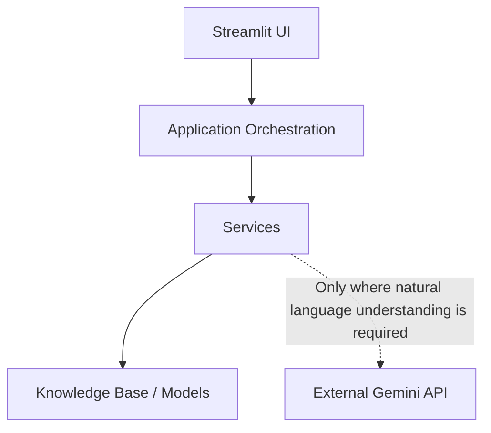

# NyayaPath Architecture

## 1. Product Overview
NyayaPath is an AI-powered civic action copilot.
It helps citizens understand rejected scholarship/welfare applications by:
1. Extracting facts from rejection notices.
2. Allowing the citizen to confirm/edit those facts.
3. Matching the case to a supported government scheme.
4. Evaluating eligibility against structured official rules.
5. Verifying whether the stated rejection reason appears supported.
6. Identifying missing evidence.
7. Determining a supported next action.
8. Generating a controlled document.
9. Presenting the complete case as a Case File.

NyayaPath is NOT:
- a general legal chatbot
- a legal representative
- a government portal
- an automated government application submission system
- a definitive legal advice service

## 2. Core Architectural Principle
The central architectural principle is:

LANGUAGE UNDERSTANDING → GEMINI
FACTUAL / LOGICAL DECISION → PYTHON

Gemini is used where natural-language understanding is required.
Python is used where deterministic reasoning is possible.
This boundary MUST NOT be weakened during UI implementation.

## 3. High-Level Pipeline
User Input
    ↓
PDF/Text Intake
    ↓
PDF Text Extraction
    ↓
Gemini Case Extraction
    ↓
Human Fact Confirmation
    ↓
Scheme Matching
    ↓
Structured Knowledge Base
    ↓
Deterministic Eligibility Engine
    ↓
Rejection Reason Interpretation
    ↓
Deterministic Rejection Verification
    ↓
Evidence Checker
    ↓
Action Planner
    ↓
Final Verifier
    ↓
Controlled Document Generator
    ↓
Case File UI

## 4. Architecture Diagram


## 5. Project Structure
```text
nyayapath/
│
├── app.py
├── requirements.txt
├── .env.example
├── .gitignore
├── README.md
│
├── config/
│   └── settings.py
│
├── data/
│   └── schemes/
│       ├── pm_usp_csss.json
│       └── top_class_sc.json
│
├── models/
│   ├── schemas.py
│   └── __init__.py
│
├── services/
│   ├── action_planner.py
│   ├── document_generator.py
│   ├── eligibility.py
│   ├── evidence_checker.py
│   ├── extraction.py
│   ├── pdf_parser.py
│   ├── rejection_verifier.py
│   ├── scheme_matcher.py
│   ├── verifier.py
│   └── __init__.py
│
├── templates/
│   └── appeal_template.docx
│
├── tests/
│   ├── test_eligibility.py
│   ├── test_insufficient_info.py
│   ├── test_rejection.py
│   ├── test_track_a.py
│   ├── test_verifier.py
│   └── fixtures/
│       └── mock_scheme.json
│
├── utils/
│   ├── citations.py
│   ├── helpers.py
│   └── __init__.py
│
└── docs/
    ├── architecture.md
    └── design.md
```

## 6. Service Responsibilities

### `pdf_parser.py`
Responsible for:
- Reading digital PDFs
- Extracting text using pypdf
- Rejecting image-only/scanned PDFs
- Returning clean extraction errors

No OCR.

### `extraction.py`
Responsible for:
- Sending necessary document text/context to Gemini
- Extracting structured CaseFacts
- Validating Gemini output against Pydantic models

Must NOT decide eligibility.

### `scheme_matcher.py`
Responsible for:
- Identifying which supported scheme applies
- Returning UNCERTAIN when matching is ambiguous
- Never inventing unsupported schemes

### `eligibility.py`
Responsible for:
- Loading structured scheme criteria
- Deterministically evaluating rules
- Returning MET / NOT_MET / UNCERTAIN

Must never use eval().

### `rejection_verifier.py`
Architecture:
Natural-language rejection
        ↓
Gemini interpretation
        ↓
Criterion mapping
        ↓
Python deterministic verification

Gemini does NOT make the final decision.

Possible states:
- CONSISTENT
- POTENTIAL_CONFLICT
- UNABLE_TO_VERIFY

### `evidence_checker.py`
Responsible for:
- Comparing available facts/documents against documented requirements
- Returning AVAILABLE / MISSING / NEEDS_VERIFICATION

### `action_planner.py`
Responsible for:
- Synthesizing eligibility
- Rejection verification
- Evidence
- Official route information

Possible routes:
- FORMAL_APPEAL
- GRIEVANCE
- CORRECTION
- REVIEW
- NO_VERIFIED_ROUTE
- UNCERTAIN

Never assume that every rejection has a formal appeal.

### `verifier.py`
Responsible for:
- Source validation
- Citation integrity
- Trust-state propagation
- Preventing unsupported conclusions

Possible states:
- PASS
- UNCERTAIN
- UNSUPPORTED
- POTENTIAL_CONFLICT

### `document_generator.py`
Responsible for:
- Controlled DOCX generation
- Using the approved template
- Populating structured data
- Never generating unrestricted legal text

## 7. Data Architecture

Relationship:
CaseFacts → Scheme → EligibilityCriterion → EligibilityResult → RejectionVerification → EvidenceItem → ActionPlan → FinalVerification

Pydantic models implemented in `models/schemas.py`.
These models define the strict structures for facts extracted from the user, the official rules of the schemes, the evidence required, and the step-by-step validation tracking for final case verification. 

## 8. Knowledge Base
The production knowledge base contains exactly two schemes:
1. PM-USP CSSS
2. Central Sector Scholarship of Top Class Education for SC Students

Rules are stored locally as structured JSON.
Each material rule must maintain:
- criterion ID
- rule type
- field
- operator/value where applicable
- source ID
- source section/page where available
- academic year
- source freshness metadata

Never fabricate missing government information.

## 9. Source / Trust Architecture
NyayaPath follows: NO SOURCE → NO DEFINITIVE CLAIM

Trust states:
- **VERIFIED**: Conclusion is supported by available facts and authoritative scheme data.
- **UNCERTAIN**: Required information, applicability, or source verification is missing.
- **POTENTIAL_CONFLICT**: Available authoritative sources appear inconsistent.
- **UNSUPPORTED**: A material claim lacks valid source support.

## 10. Security
- API key stored through environment configuration
- `.env` never committed
- `.env.example` provided
- Sensitive user data should not be unnecessarily logged
- Gemini receives only information necessary for extraction/interpretation
- No persistent applicant database in MVP
- No authentication system in MVP

## 11. Testing Architecture
27 tests currently passing.

Explain test categories:
- deterministic eligibility
- missing information
- rejection verification
- source integrity
- academic-year preservation
- source freshness
- cross-scheme isolation
- malformed rule handling
- document validation
- uncertainty propagation

Tests validate application behavior, not the absolute truth of government policy.

## 12. Architectural Non-Goals
The MVP does NOT use:
- RAG
- Vector DB
- PostgreSQL
- Graph DB
- Microservices
- Agent orchestration frameworks
- OCR
- Voice
- Multilingual interfaces
- Automated government submission
- Legal representation

## 13. Architectural Principles
1. Deterministic over probabilistic where possible.
2. Human confirmation before consequential reasoning.
3. Source-backed over confidence-based.
4. Explicit uncertainty over guessing.
5. Controlled generation over unrestricted generation.
6. Modular services over monolithic logic.
7. Simple architecture over unnecessary infrastructure.

---
*These documents are the design and architecture source of truth for NyayaPath. Any implementation change that materially affects architecture, trust behavior, or user experience should update these documents.*
